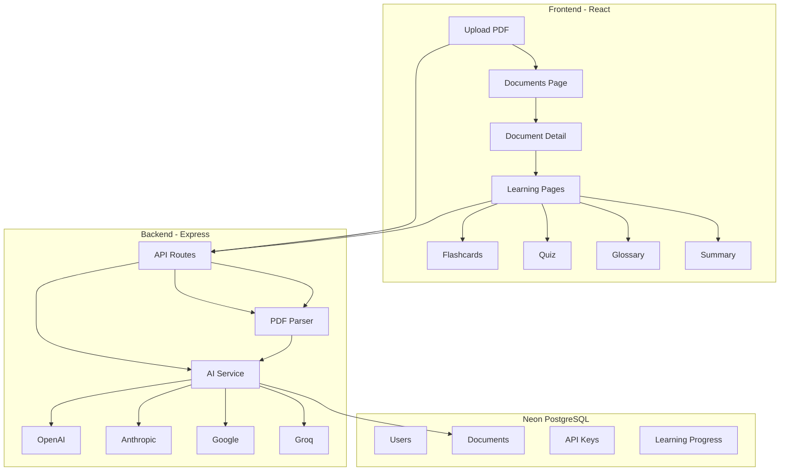
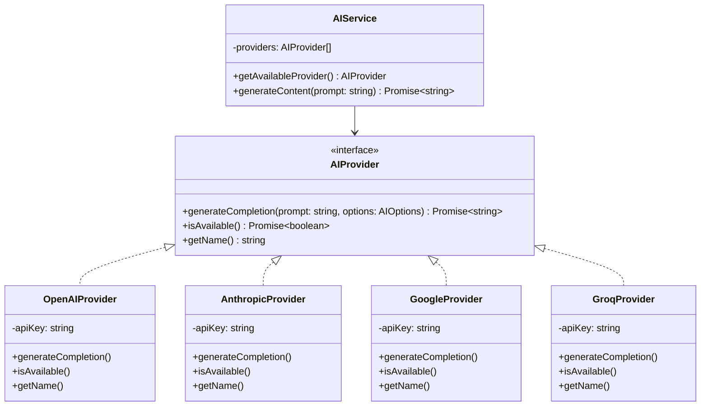
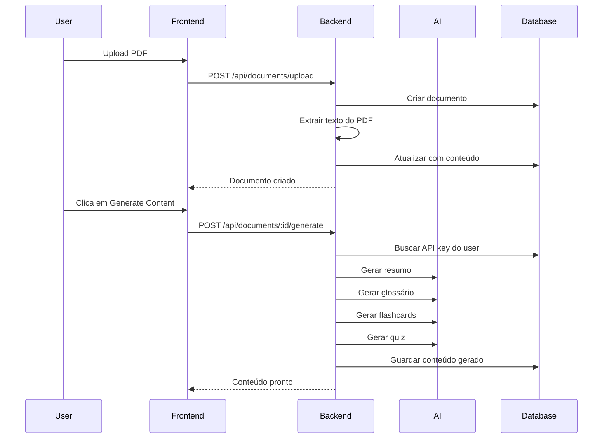

# Doc2Learn - Próximas Funcionalidades

## Visão Geral

O projeto tem a base funcional (autenticação, upload de documentos, API keys). Agora precisamos implementar o core do produto: **transformar PDFs em experiências de aprendizagem usando IA**.

## Arquitetura Proposta



---

## Fase 1: Sistema de Upload com Parsing de PDFs

### Objetivo
Permitir upload de PDFs e extrair o texto para processamento.

### Tarefas

#### 1.1 Instalar dependências
```bash
npm install multer pdf-parse
npm install -D @types/multer
```

#### 1.2 Criar rota de upload com ficheiro
- `POST /api/documents/upload` - recebe ficheiro PDF via multipart/form-data
- Usa `multer` para handling do ficheiro
- Usa `pdf-parse` para extrair texto
- Guarda documento com conteúdo extraído

#### 1.3 Atualizar frontend
- Modificar `documents.tsx` para usar `FormData`
- Mostrar progresso de upload
- Mostrar status de processamento

### Ficheiros a criar/modificar
| Ficheiro | Ação |
|----------|------|
| `server/middleware/upload.ts` | Criar - configuração multer |
| `server/routes/documents.ts` | Modificar - adicionar rota upload |
| `server/lib/pdf-parser.ts` | Criar - wrapper pdf-parse |
| `src/pages/documents.tsx` | Modificar - usar FormData |

---

## Fase 2: Sistema de Abstração de IA

### Objetivo
Criar uma camada de abstração que suporte múltiplos providers de IA.

### Arquitetura



### Tarefas

#### 2.1 Criar interface base
```typescript
// server/lib/ai/types.ts
interface AIOptions {
  maxTokens?: number
  temperature?: number
  model?: string
}

interface AIProvider {
  generateCompletion(prompt: string, options?: AIOptions): Promise<string>
  isAvailable(): Promise<boolean>
  getName(): string
}
```

#### 2.2 Implementar providers
- OpenAI (GPT-4, GPT-3.5)
- Anthropic (Claude 3)
- Google (Gemini)
- Groq (Llama, Mixtral)

#### 2.3 Criar AIService
- Seleciona provider disponível
- Fallback para providers alternativos
- Usa API keys do utilizador ou variáveis de ambiente

### Ficheiros a criar
| Ficheiro | Descrição |
|----------|-----------|
| `server/lib/ai/types.ts` | Tipos e interfaces |
| `server/lib/ai/providers/base.ts` | Classe abstrata |
| `server/lib/ai/providers/openai.ts` | Provider OpenAI |
| `server/lib/ai/providers/anthropic.ts` | Provider Anthropic |
| `server/lib/ai/providers/google.ts` | Provider Google |
| `server/lib/ai/providers/groq.ts` | Provider Groq |
| `server/lib/ai/index.ts` | AIService principal |

---

## Fase 3: Geração de Conteúdo de Aprendizagem

### Objetivo
Gerar flashcards, quiz, glossário e resumo a partir do conteúdo do documento.

### Fluxo de Processamento



### Prompts de IA

#### Resumo
```
You are an expert educator. Create a comprehensive summary of the following document. 
Focus on the main concepts, key points, and important details.

Document content:
{content}

Provide a well-structured summary in markdown format.
```

#### Glossário
```
You are an expert educator. Extract key terms and concepts from the following document.
For each term, provide a clear and concise definition.

Document content:
{content}

Return as JSON array: [{"term": "...", "definition": "..."}]
```

#### Flashcards
```
You are an expert educator. Create flashcards from the following document.
Each flashcard should have a question on the front and an answer on the back.

Document content:
{content}

Return as JSON array: [{"front": "...", "back": "..."}]
```

#### Quiz
```
You are an expert educator. Create a quiz from the following document.
Each question should have 4 options and indicate the correct answer.

Document content:
{content}

Return as JSON array: [{"question": "...", "options": ["...", "...", "...", "..."], "correct": 0}]
```

### Tarefas

#### 3.1 Criar rota de geração
- `POST /api/documents/:id/generate`
- Verifica se utilizador tem API key configurada
- Processa documento em background
- Atualiza progresso

#### 3.2 Criar prompts templates
- Templates para cada tipo de conteúdo
- Sistema de versionamento de prompts

#### 3.3 Atualizar frontend
- Botão Generate Content na página de detalhes
- Indicador de progresso
- Visualização do conteúdo gerado

### Ficheiros a criar/modificar
| Ficheiro | Ação |
|----------|------|
| `server/routes/documents.ts` | Modificar - adicionar rota generate |
| `server/lib/prompts.ts` | Criar - templates de prompts |
| `src/pages/document-detail.tsx` | Modificar - UI de geração |
| `src/pages/learning/*.tsx` | Modificar - mostrar conteúdo real |

---

## Dependências a Instalar

```bash
# PDF Processing
npm install multer pdf-parse
npm install -D @types/multer

# AI SDKs
npm install openai @anthropic-ai/sdk @google/generative-ai groq-sdk

# Utilities
npm install zod
```

---

## Ordem de Implementação

1. **Fase 1** - Sistema de Upload com Parsing
   - Permite extrair texto dos PDFs
   - Base para as próximas fases

2. **Fase 2** - Sistema de Abstração de IA
   - Começar com OpenAI apenas
   - Adicionar outros providers gradualmente

3. **Fase 3** - Geração de Conteúdo
   - Implementar resumo primeiro (mais simples)
   - Depois glossário, flashcards, quiz

---

## Considerações

### Custos de IA
- OpenAI GPT-4: ~$0.03/1K tokens input, ~$0.06/1K tokens output
- Claude 3: ~$0.015/1K tokens input, ~$0.075/1K tokens output
- Groq (Llama): Gratuito com rate limits

### Rate Limiting
- Implementar fila de processamento
- Limitar documentos por utilizador
- Cache de resultados

### Segurança
- API keys encriptadas na base de dados
- Validação de input
- Sanitização de output de IA
