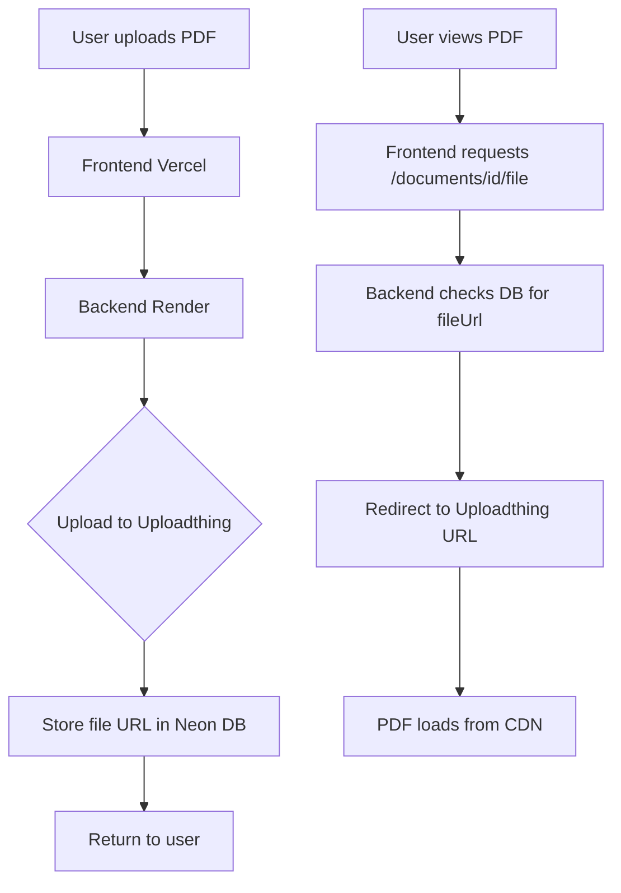

# PDF Storage Migration Plan

## Overview
Migrate PDF storage from local filesystem (ephemeral on Render) to **Uploadthing** - a modern file storage solution optimized for serverless environments.

## Why Uploadthing?

| Feature | Uploadthing | AWS S3 | Vercel Blob |
|---------|-------------|--------|-------------|
| Free Tier | 2GB storage | 5GB (12 months) | No free tier |
| Setup Complexity | Simple | Complex | Simple |
| Large Files (50MB+) | ✅ Supported | ✅ Supported | ✅ Supported |
| CDN | ✅ Included | ✅ CloudFront extra | ✅ Included |
| Works with Render | ✅ Yes | ✅ Yes | ⚠️ Optimized for Vercel |
| SDK | Excellent | Good | Good |

**Decision: Uploadthing** - Best balance of free tier, simplicity, and compatibility.

## Architecture



## Implementation Steps

### Phase 1: Setup Uploadthing

#### 1.1 Install Dependencies
```bash
npm install uploadthing @uploadthing/express
```

#### 1.2 Environment Variables
Add to `.env`:
```
UPLOADTHING_SECRET=utm_xxxxx
UPLOADTHING_APP_ID=xxxxx
```

#### 1.3 Create Uploadthing Client
File: `server/lib/uploadthing.ts`

### Phase 2: Update Database Schema

#### 2.1 Add Fields to Document Model
```prisma
model Document {
  // ... existing fields
  fileUrl      String?   // Uploadthing URL
  fileKey      String?   // Uploadthing key for deletion
}
```

#### 2.2 Run Migration
```bash
npx prisma migrate dev --name add_file_url
```

### Phase 3: Update Upload Route

#### 3.1 Modify `/api/documents/upload`
- Remove local filesystem storage
- Upload directly to Uploadthing
- Store `fileUrl` and `fileKey` in database

#### 3.2 Update File Serving Route
- `/api/documents/:id/file` redirects to Uploadthing URL
- Or use signed URLs for private access

### Phase 4: Update Middleware

#### 4.1 Remove Multer Disk Storage
- Use memory storage instead
- Pass buffer to Uploadthing

### Phase 5: Cleanup

#### 5.1 Remove Local Uploads Folder
- Delete `uploads/` directory
- Remove Cloudinary client (not needed)

#### 5.2 Update Documentation
- Update README with Uploadthing setup
- Update `.env.example`

## File Structure Changes

```
server/
├── lib/
│   ├── uploadthing.ts     # NEW - Uploadthing client
│   ├── cloudinary.ts      # DELETE - Not needed
│   └── ...
├── middleware/
│   └── upload.ts          # MODIFY - Memory storage only
├── routes/
│   └── documents.ts       # MODIFY - Upload to Uploadthing
uploads/                    # DELETE - No longer needed
```

## Code Changes

### server/lib/uploadthing.ts (NEW)
```typescript
import { createUploadthing, type UploadthingFileRouter } from '@uploadthing/express';

const f = createUploadthing();

export const uploadRouter = {
  pdfUploader: f({ pdf: { maxFileSize: '50MB', maxFileCount: 1 } })
    .middleware(async ({ req }) => {
      // Verify authentication
      const user = await verifyAuth(req);
      return { userId: user.id };
    })
    .onUploadComplete(async ({ metadata, file }) => {
      console.log('Upload complete for userId:', metadata.userId);
      return { fileUrl: file.url, fileKey: file.key };
    }),
} satisfies UploadthingFileRouter;

export type OurFileRouter = typeof uploadRouter;
```

### server/routes/documents.ts (MODIFIED)
```typescript
// Upload route changes
router.post('/upload', authenticateToken, requireAuth, async (req, res) => {
  // 1. Parse PDF from buffer
  // 2. Upload to Uploadthing
  // 3. Store fileUrl and fileKey in database
  // 4. Return document with metadata
});

// File serving route changes
router.get('/:id/file', authenticateToken, requireAuth, async (req, res) => {
  const document = await prisma.document.findFirst(...);
  if (document.fileUrl) {
    return res.redirect(document.fileUrl);
  }
  // Fallback for old files
});
```

## Migration Strategy

### For Existing Documents
1. Keep `filePath` field for backward compatibility
2. New uploads use `fileUrl` and `fileKey`
3. Serve old files from local (if any) or mark as unavailable

### For New Documents
1. All new uploads go to Uploadthing
2. Database stores `fileUrl` for serving
3. Database stores `fileKey` for deletion

## Testing Checklist

- [ ] Upload PDF < 10MB
- [ ] Upload PDF > 10MB (up to 50MB)
- [ ] View PDF in browser
- [ ] Delete document (verify file removed from Uploadthing)
- [ ] Test with multiple users
- [ ] Verify file isolation between users

## Cost Estimation

| Usage | Uploadthing Free | Uploadthing Pro |
|-------|------------------|-----------------|
| Storage | 2GB | 10GB ($10/mo) |
| Bandwidth | Unlimited | Unlimited |
| Files | Unlimited | Unlimited |

**Recommendation**: Start with free tier, upgrade when approaching 2GB limit.

## Rollback Plan

If issues arise:
1. Revert to local filesystem storage
2. Use Render persistent disk ($7/mo + $0.25/GB)
3. Or implement AWS S3 as alternative

## Timeline

1. **Setup Uploadthing** - Create account, get API keys
2. **Install dependencies** - `npm install uploadthing @uploadthing/express`
3. **Create uploadthing.ts** - Configure client
4. **Update Prisma schema** - Add fileUrl, fileKey fields
5. **Modify upload route** - Use Uploadthing instead of local
6. **Modify serve route** - Redirect to Uploadthing URL
7. **Test thoroughly** - All file operations
8. **Deploy** - Push to production
9. **Monitor** - Check for issues

## Next Steps

1. Create Uploadthing account at https://uploadthing.com
2. Get API keys from dashboard
3. Switch to Code mode to implement changes
